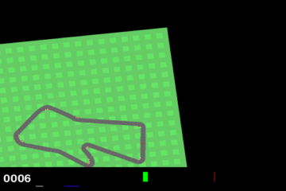

# World Models - CSCI 467 Project

A PyTorch implementation of [World Models](https://worldmodels.github.io/) (Ha & Schmidhuber, 2018) for the CarRacing-v3 environment.



> Trained agent driving CarRacing-v3. See the **[results & demo gallery](docs/README.md)** for more GIFs, VAE reconstructions, and training curves.

## Architecture Overview

```
┌─────────────────────────────────────────────────────────────────┐
│                        WORLD MODELS                             │
├─────────────────────────────────────────────────────────────────┤
│                                                                 │
│   ┌─────────┐      ┌─────────┐      ┌────────────┐             │
│   │  VAE    │      │ MDN-RNN │      │ Controller │             │
│   │ (V)     │      │ (M)     │      │ (C)        │             │
│   └────┬────┘      └────┬────┘      └─────┬──────┘             │
│        │                │                  │                    │
│   64x64x3 → z(32)   z+a → h(256)      z+h → action            │
│   1.78M params      422K params        867 params              │
│                                                                 │
└─────────────────────────────────────────────────────────────────┘
```

## Quick Start

```bash
# 1. Setup environment
./scripts/setup.sh

# 2. Collect data (250 episodes x 400 steps, ~4 min on 8 threads)
python -m scripts.collect_data --episodes 250 --threads 8 --max-steps 400

# 3. Train VAE — use a small KL weight to avoid posterior collapse (~10 min)
python -m scripts.train_vae --epochs 15 --kl-weight 0.0001

# 4. Train Controller with PPO (~2 hours on an RTX 3080)
python -m scripts.train_controller_ppo --timesteps 500000 --eval-freq 25000

# 5. Record gameplay GIFs + generate result plots
python -m scripts.record_demo --ppo-model checkpoints/ppo_controller/best_model.zip --episodes 10 --out-dir docs
python -m scripts.plot_results
```

> **Note:** training the VAE with the default `--kl-weight 1.0` causes *posterior
> collapse* on CarRacing (the latents are ignored and reconstructions become
> identical blurry frames). Use `--kl-weight 0.0001` as above.

## Full Training Pipeline

```bash
# 1. Collect more data (2000 episodes)
python -m scripts.collect_data --episodes 2000 --threads 8

# 2. Train VAE (10 epochs)
python -m scripts.train_vae --epochs 10

# 3. Train MDN-RNN (20 epochs)
python -m scripts.train_mdrnn --epochs 20

# 4. Train Controller
# Option A: CMA-ES (original paper, 2-4 days)
python -m scripts.train_controller_cma --generations 500

# Option B: PPO (faster, ~6-12 hours)
python -m scripts.train_controller_ppo --timesteps 1000000
```

## Project Structure

```
worldModels_CSCI_467/
├── models/
│   ├── vae.py          # Vision model (V)
│   ├── mdrnn.py        # Memory model (M) 
│   └── controller.py   # Controller (C)
├── data/
│   └── (collected episodes stored here)
├── utils/
│   ├── misc.py         # Helper functions
│   └── envs.py         # Environment wrappers
├── configs/
│   └── default.py      # Hyperparameters
├── scripts/
│   ├── setup.sh        # Environment setup
│   ├── collect_data.py # Data collection
│   ├── train_vae.py    # VAE training
│   ├── train_mdrnn.py  # MDN-RNN training
│   ├── train_controller_ppo.py
│   ├── train_controller_cma.py
│   ├── record_demo.py   # Record gameplay GIFs
│   └── plot_results.py  # Generate result plots
├── docs/                # Results, demo GIFs, plots (portfolio display)
├── checkpoints/        # Saved models
├── logs/               # Training logs
├── requirements.txt
└── README.md
```

## Requirements

- Python 3.10+
- PyTorch 2.0+
- NVIDIA GPU with 8GB+ VRAM (RTX 3080 recommended)
- 16GB+ RAM

## Results

| Method | Score (avg ± std) | Best | Training Time |
|--------|-------------------|------|---------------|
| **This prototype** (VAE + PPO, 500k steps) | **285 ± 195** | **600** | ~2 hours (RTX 3080 Laptop) |
| Full (VAE + MDN-RNN + CMA-ES) | ~850-900 | - | 3-5 days |
| Paper reported | 906 ± 21 | - | - |

Full results, plots, and gameplay recordings: **[docs/README.md](docs/README.md)**.

## References

- [World Models Paper](https://arxiv.org/abs/1803.10122)
- [Interactive Article](https://worldmodels.github.io/)
- [ctallec PyTorch Implementation](https://github.com/ctallec/world-models)

## Authors

CSCI 467 - Machine Learning Project
