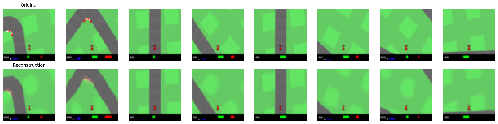
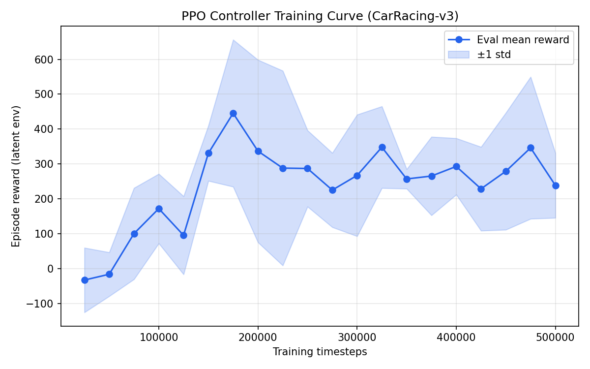
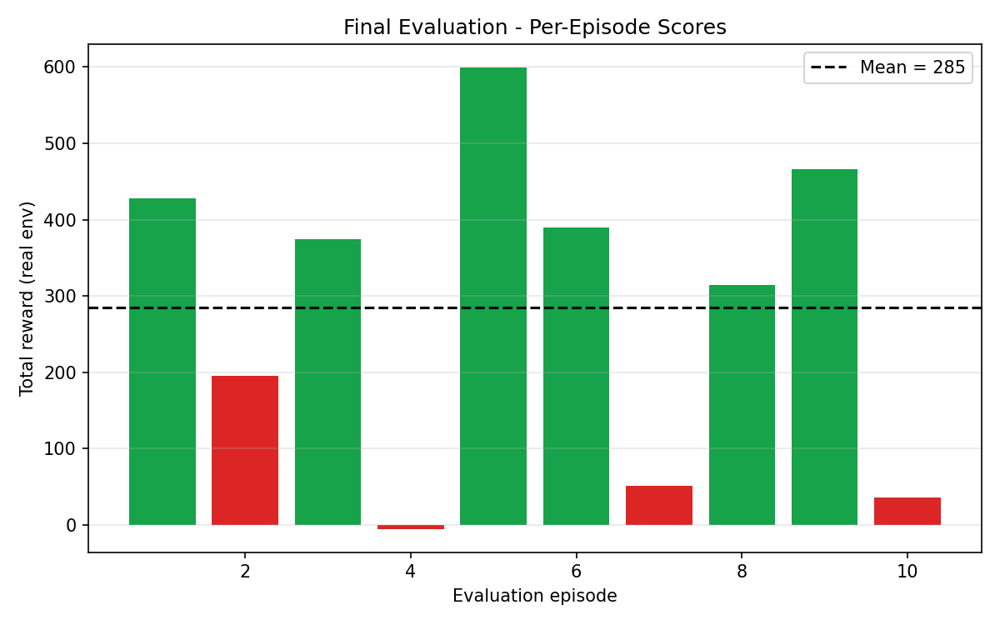

# World Models — Results & Demo Gallery

Self-driving agent for **CarRacing-v3**, trained with the [World Models](https://worldmodels.github.io/)
approach (Ha & Schmidhuber, 2018): a Variational Autoencoder compresses each
frame into a 32-D latent, and a controller learns to drive from those latents
using PPO.

> **Prototype configuration** (VAE + PPO controller, no MDN-RNN). Trained
> end-to-end on a single RTX 3080 Laptop GPU in a few hours.

---

## Agent gameplay

The trained agent driving CarRacing-v3 (best recorded run, score **398**):


More runs are in [`gifs/`](gifs/) — each filename includes its score, e.g.
`episode_2_score_398.gif`.

---

## What the agent "sees" — VAE reconstructions

The Vision model (VAE) compresses every 64×64 frame to a 32-dimensional vector
and reconstructs it. Top row = original frame, bottom row = reconstruction from
the 32-D latent. The latent faithfully captures track curvature, the car, and
the speed/steering indicator bar:



---

## Results

### PPO controller training curve

Evaluation reward over 500k training timesteps (mean ± std over 5 eval episodes):



### Final evaluation (real environment, 10 episodes)



| Metric | Value |
|--------|-------|
| Mean score | **285 ± 195** |
| Best episode | **600** |
| Training timesteps | 500,000 |
| Wall-clock training | ~2 hours (RTX 3080 Laptop) |

CarRacing is high-variance at this training budget: the agent completes most
tracks competently but occasionally spins out early, which widens the spread.

---

## Pipeline summary

| Stage | Config | Output |
|-------|--------|--------|
| **Data collection** | 250 episodes × 400 steps, Brownian policy | 100,000 frames (`data/episodes.npz`) |
| **VAE (Vision)** | 15 epochs, latent dim 32, β=1e-4 | val recon MSE 0.0002 (`checkpoints/vae_best.pt`) |
| **Controller** | PPO, 500k steps, on VAE latents | `checkpoints/ppo_controller/best_model.zip` |

> **Implementation note:** the VAE was initially retrained after the default
> `kl_weight=1.0` caused *posterior collapse* (latents ignored, identical blurry
> reconstructions). Dropping β to `1e-4` restored informative latents — visible
> in the sharp reconstructions above.

---

## Reproduce

```bash
# 1. Collect rollouts
python -m scripts.collect_data --episodes 250 --threads 8 --max-steps 400

# 2. Train the VAE (small KL weight to avoid posterior collapse)
python -m scripts.train_vae --epochs 15 --kl-weight 0.0001

# 3. Train the PPO controller
python -m scripts.train_controller_ppo --timesteps 500000 --eval-freq 25000

# 4. Record gameplay GIFs into docs/
python -m scripts.record_demo \
    --ppo-model checkpoints/ppo_controller/best_model.zip \
    --episodes 10 --out-dir docs

# 5. Regenerate result plots
python -m scripts.plot_results
```

Raw per-episode demo metrics: [`demo_results.json`](demo_results.json).
